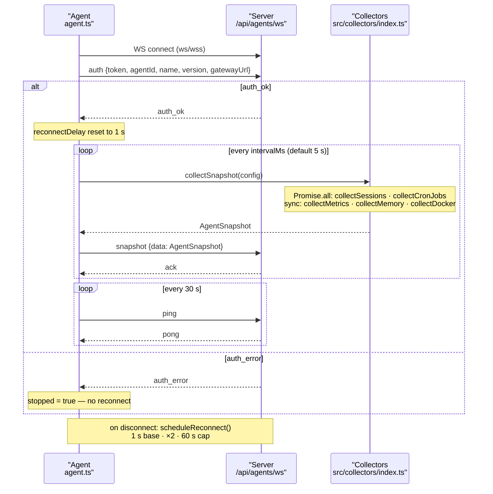

# clawd-monitor-agent

Push-based monitoring agent for [clawd-monitor](https://github.com/LanNguyenSi/clawd-monitor).

Runs on each OpenClaw host, connects outbound to a central clawd-monitor dashboard, and pushes live snapshots every 5 seconds — no inbound ports required on the agent host.

## What it collects

| Data | Description |
|------|-------------|
| Sessions | Active OpenClaw sessions (read from local JSONL files) |
| Cron Jobs | Scheduled jobs with next/last run times |
| CPU + RAM | System metrics via `/proc` |
| Memory files | MEMORY.md, CURRENT.md, today's + yesterday's daily log |
| Docker containers | All containers (running/stopped), state, uptime, restarts |
| Session messages | Last 5 messages per session (embedded in snapshot) |

## Install

### One-line installer (recommended)

On the host you want to monitor (Debian/Ubuntu, root):

```bash
curl -fsSL https://raw.githubusercontent.com/LanNguyenSi/clawd-monitor-agent/master/install.sh \
  | sudo bash -s -- \
      --server wss://your-clawd-monitor-domain \
      --token <agent-token-from-settings>
```

Installs Node 18+ (via NodeSource if needed), the `clawd-monitor-agent` npm package, a dedicated `clawd-agent` system user, a config at `/etc/clawd-monitor-agent/config.json` (mode 0640), and a hardened systemd unit. Re-running with the same args is an idempotent restart; re-running with a different `--token` rotates the token. The token is never echoed to stdout and is not embedded in the unit file.

Full flag list: `bash install.sh --help`.

### Manual install

```bash
npm install -g clawd-monitor-agent
```

## Usage

```bash
clawd-monitor-agent \
  --server https://your-clawd-monitor-domain \
  --token <agent-token-from-settings> \
  --name "My OpenClaw Host" \
  --gateway http://localhost:18789
```

Get the token from the clawd-monitor Settings page (Settings → Agent Tokens → Generate).

## Options

| Flag | Default | Description |
|------|---------|-------------|
| `--server` | — | clawd-monitor URL (required) |
| `--token` | — | Agent token from Settings (required) |
| `--name` | hostname | Display name in dashboard |
| `--gateway` | `http://localhost:18789` | OpenClaw gateway URL |
| `--gateway-token` | — | OpenClaw gateway auth token |
| `--clawd-dir` | `~/.openclaw/workspace` | Path to OpenClaw workspace (memory files only — see note) |
| `--interval` | `5000` | Snapshot push interval (ms, minimum 1000) |
| `--config` | — | Path to JSON config file |
| `--no-memory` | off | Disable memory-file collection (collected by default) |
| `--no-docker` | off | Disable Docker collection (collected by default) |
| `--debug` | off | Enable debug logging |
| `--version` | — | Print version and exit |
| `--help`, `-h` | — | Show usage and exit |

`--clawd-dir` only governs where memory files (`MEMORY.md`, `CURRENT.md`, daily logs) are read from. Session discovery ignores it: sessions are always read from `~/.openclaw/agents/main/sessions/*.jsonl`.

## Config file

```json
{
  "server": "https://your-clawd-monitor-domain",
  "token": "<agent-token>",
  "name": "My OpenClaw Host",
  "gateway": {
    "url": "http://localhost:18789"
  },
  "collect": {
    "sessions": true,
    "cron": true,
    "metrics": true,
    "memory": true,
    "docker": true
  },
  "intervalMs": 5000
}
```

## As a systemd service

```ini
[Unit]
Description=clawd-monitor agent
After=network.target

[Service]
ExecStart=/usr/bin/clawd-monitor-agent \
  --server https://your-clawd-monitor-domain \
  --token <agent-token> \
  --name "My OpenClaw Host" \
  --gateway http://localhost:18789
Restart=always
RestartSec=10

[Install]
WantedBy=multi-user.target
```

## Protocol

The agent opens a single outbound WebSocket to `<server>/api/agents/ws`
(the `--server` URL with `http`/`https` rewritten to `ws`/`wss`). It is a
small JSON message protocol; it is pre-1.0 and may change between minor
versions (see the CHANGELOG note).

- On connect the agent sends an `auth` message (token, agentId, name,
  version, and the gateway URL/token). The server replies `auth_ok` or
  `auth_error`. On `auth_error` the agent stops and does not reconnect.
- After `auth_ok` the agent pushes a `snapshot` message on every interval
  (default 5s); the server may reply `ack`.
- The agent sends a `ping` every 30s and expects a `pong`.
- If the connection drops, the agent reconnects with exponential backoff
  starting at 1s, doubling up to a 60s cap, reset on the next successful
  auth.

## WebSocket lifecycle

The agent maintains a single outbound WebSocket connection with an auth handshake, a periodic snapshot push loop, and a separate heartbeat.



## Changelog

See [CHANGELOG.md](./CHANGELOG.md) for the per-release notes.

---

*Part of the [clawd-monitor](https://github.com/LanNguyenSi/clawd-monitor) ecosystem*
