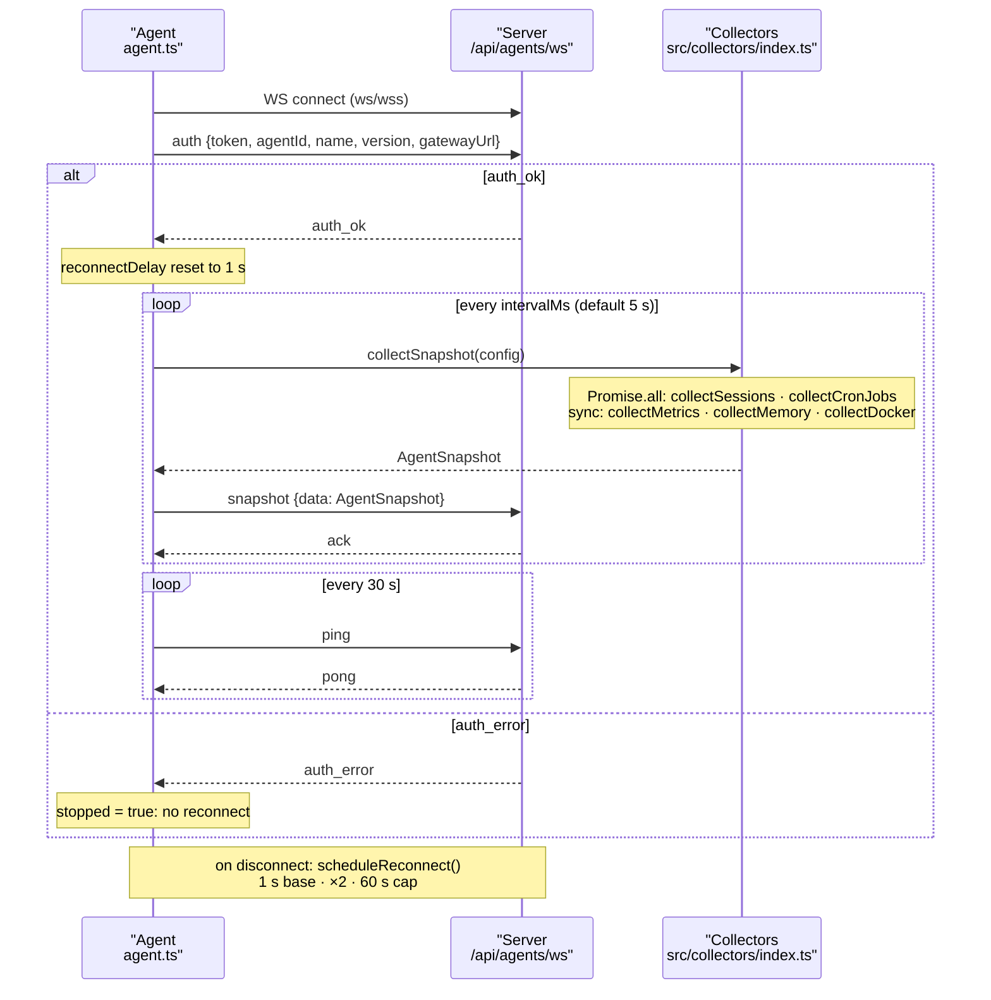

# Protocol and lifecycle

The agent opens a single outbound WebSocket to `<server>/api/agents/ws`
(the `--server` URL with `http`/`https` rewritten to `ws`/`wss`). It is a
small JSON message protocol; it is pre-1.0 and may change between minor
versions (see the CHANGELOG note).

- On connect the agent sends an `auth` message (token, agentId, name,
  version, and the gateway URL/token). The server replies `auth_ok` or
  `auth_error`. On `auth_error` the agent stops and does not reconnect.
- After `auth_ok` the agent pushes a `snapshot` message on every interval
  (default 5s); the server may reply `ack`.
- The agent sends a `ping` every 30s and expects a `pong`.
- If the connection drops, the agent reconnects with exponential backoff
  starting at 1s, doubling up to a 60s cap, reset on the next successful
  auth.

## WebSocket lifecycle

The agent maintains a single outbound WebSocket connection with an auth handshake, a periodic snapshot push loop, and a separate heartbeat.

